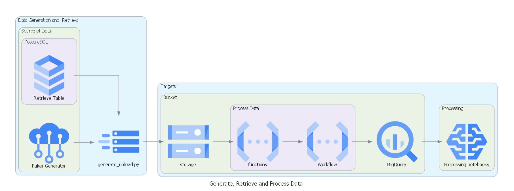

# Pipeline for Machine Learning Plazza

**Code is available on this Git Repository : https://github.com/Uduv/ml_pipeline_for_gcp**

# Big Picture

In this article, you will learn how to develop a pipeline that generates a dataset and retrieves data from a PostgreSQL database, then uploads the data to a GCP bucket. Once the upload is complete, a Cloud Function is triggered to generate a table on BigQuery for each file.


*Diagram of Processes*



# 1. Data Generation and Retrieval

## 1.1 Generate Dataset

First, we will generate a dataset and retrieve it from an external source, in our case PostgreSQL.

Datasets are generated using the Faker Python package and classic random number generation. Random generation has been preferred in specific use cases rather than Faker to reduce the resources needed to generate files.

You can find two dataset generator scripts for client and movie datasets in the repository.

*Code of the Client Dataset Generator can be [found here](https://github.com/Uduv/ml_pipeline_for_gcp/blob/master/Generation/generate_client/generate_client.py)* [↗️.](https://github.com/Uduv/ml_pipeline_for_gcp/blob/master/Triggers/WorkflowTrigger/workflow-csv.yaml)

## 1.2 Preview of datasets

Example of dataset that you can obtain with Faker dataset generation

### *Preview of film dataset*

| Title | Genre | Premiere | Runtime | Rating Score | Language | Author |
| --- | --- | --- | --- | --- | --- | --- |
| Drive Billion Real | Documentary | 07/01/06 | 358 | 5.697228 | English | Danny Hudson |
| Floor Family Worry | Action | 89/07/09 | 114 | 0.772004 | Italian | John Pruitt |
| Create First Week | Horror | 09/02/04 | 74 | 3.676618 | Italian | Anthony Perez |
| Police His Population | Comedy | 05/06/14 | 125 | 7.304545 | Hindi | Matthew Jackson |
| Report Country So | Horror | 78/07/14 | 107 | 8.982453 | Chinese | Jason Delgado |

### *Preview of client dataset*

| name | sex | mail | client_movie_genres | client_language_spoken | client_car | credit_score |
| --- | --- | --- | --- | --- | --- | --- |
| Charles House | Male | charleshouse@gmail.com | Horror,Thriller,Mystery | Spanish,Japanese | Kia Sorento | 775 |
| Tiffany Parsons | Male | tiffanyparsons@gmail.com | Action,Romance,Thriller,Documentary,Drama,Horror,Comedy,Mystery | Spanish,Chinese | Mercury Villager | 559 |
| George Maldonado | Female | georgemaldonado@hotmail.com | Action,Mystery,Thriller,Horror,Drama,Documentary,Comedy | Japanese,Spanish | Volkswagen Touareg | 615 |
| Jessica Roberts | Male | jessicaroberts@orange.com | Documentary,Horror,Romance | Italian | Volvo V70 | 473 |
| Natalie Delgado | Female | nataliedelgado@hotmail.com | Action,Horror,Thriller,Romance | English,Spanish,Italian | Nissan NV3500 HD Passenger | 309 |

## 1.3 PostgreSQL Database queried with python

To retrieve data from a PostgreSQL database, you can use the script available at this [link ↗️](https://github.com/Uduv/ml_pipeline_for_gcp/blob/master/Data_PostgreSQL/connect_to_postgreSQL.py) .

To reproduce a system where you retrieve data from a database, you need to set up a database with PostgreSQL. Once you have set up the database, you can use the `psycopg2` package to query the database. Code can be [found here ↗️.](https://github.com/Uduv/ml_pipeline_for_gcp/blob/master/Data_PostgreSQL/connect_to_postgreSQL.py)

*Preview of PostgreSQL example dataset :*

| Time | V1 | V2 | V3 | V4 | … | V27 | Amount | Class |
| --- | --- | --- | --- | --- | --- | --- | --- | --- |
| 0 | -1.35981 | -0.07278 | 2.536347 | 1.378155 | … | 0.133558 | 149.62 | 0 |
| 0 | 1.191857 | 0.266151 | 0.16648 | 0.448154 | … | -0.00898 | 2.69 | 0 |
| 1 | -1.35835 | -1.34016 | 1.773209 | 0.37978 | … | -0.05535 | 378.66 | 0 |
| 1 | -0.96627 | -0.18523 | 1.792993 | -0.86329 | … | 0.062723 | 123.5 | 0 |
| 2 | -1.15823 | 0.877737 | 1.548718 | 0.403034 | … | 0.219422 | 69.99 | 0 |
| 2 | -0.42597 | 0.960523 | 1.141109 | -0.16825 | … | 0.253844 | 3.67 | 0 |
| 4 | 1.229658 | 0.141004 | 0.045371 | 1.202613 | … | 0.034507 | 4.99 | 0 |

# 2. GCP

You can get an GCP sandbox on [this link](https://plazza.orange.com/docs/DOC-2088880) ↗️ available maximum 21 days or obtain a 90 days free project with a [Google account ↗️.](https://cloud.google.com/free/?utm_source=google&utm_medium=cpc&utm_campaign=emea-ro-all-en-bkws-all-all-trial-e-gcp-1011340&utm_content=text-ad-none-any-DEV_c-CRE_619252260196-ADGP_Hybrid%20%7C%20BKWS%20-%20EXA%20%7C%20Txt%20~%20GCP%20~%20Trial-KWID_43700072834187129-kwd-931452961599-userloc_1011795&utm_term=KW_300%20credit%20google%20cloud-NET_g-PLAC_&gclid=CjwKCAiAr4GgBhBFEiwAgwORrVci1y85qFDPI336N8BAkc-dYDJH8wB2KrZk_71H5yqSlszfCTIgABoCm_YQAvD_BwE&gclsrc=aw.ds)

GCP stands for Google Cloud Platform, which is a suite of cloud computing services offered by Google that provides infrastructure, platform, and software services for building and deploying applications and managing data.

## 2.1 Upload Data to GCP

The script [upload_files_gcp.py ↗️](https://github.com/Uduv/ml_pipeline_for_gcp/blob/master/Upload/upload_files_gcp.py) is available to upload files to GCP using the Gcloud SDK client. To use the Gcloud SDK, you must first set up your account. You can find the Gcloud SDK client [here ↗️](https://cloud.google.com/sdk/docs/install).

Once set up, the SDK generates an SSH token in your `%AppData% local/gcloud/` folder that is required to process Gcloud API calls.

To upload a file, you will need to trigger the `upload_blob` function, which gathers all necessary information to log in to the cloud and upload the file specified as a parameter during the function call.

```python
def upload_blob(bucket_name="BUCKET_NAME" , source_file_name="PATH\DATASET.csv", destination_blob_name="client_remote.csv"):
    """Uploads a file to the bucket.
    The ID of your GCS \n
    bucket_name = "your-bucket-name" \n
    The path to your file to upload \n
    source_file_name = "local/path/to/file" \n
    The ID of your GCS object \n
    destination_blob_name = "storage-object-name"
    """

    storage_client = storage.Client()
    bucket = storage_client.bucket(bucket_name)
    blob = bucket.blob(destination_blob_name)
    try : 
        blob.upload_from_filename(source_file_name)
    except Exception as e:
        print('You may disconnect to the VPN') #if you re connected to Orange VPN
        print(e)
        exit()
        
    print(
        f"File {source_file_name} uploaded to {destination_blob_name}."
    )
```

## 2.2 Google Cloud Storage

Google Cloud Storage bucket is a scalable and secure container in the GCP for storing and accessing data objects from anywhere, with integration to other GCP services.

You will need a bucket on Cloud Storage, which has an ID that the GCP SDK will use to identify where to send files on your Cloud.

## 2.3 Transfer dataset From GCS to BigQuery

### Idea

We want to transfer Dataset from GCS to BigQuery table and two solutions can be used.

1. A **Cloud Functions** check each of the files uploaded on your Cloud Storage. If the file is a CSV or parquet, the Functions call a Cloud Workflow to generate or append a BigQuery table. 
2. A **BigQuery Data Transfers** service. The service allow you to set up a source of various types (GCS, AWS S3, Google Ads …), schedule auto retrieve and ingress database to a BigQuery table. 

We will choose to use the first option for our pipeline, and you can find a full [tutorial link ↗️.](https://medium.com/codeshake/build-a-serverless-bigquery-ingestion-pipeline-using-cloud-workflows-f893f6b701ee)

### Cloud Functions and Cloud Workflows

Google Cloud Functions is a serverless execution environment for building and connecting cloud services such as Python, Java, Go. A function is triggered when an event being watched is fired, such as a file uploaded on a GCS.

### Functioning

**Cloud Functions:**

When our Cloud Functions is triggered, The Cloud Functions generate a dictionary with the file information (filename, object, bucket) and transfer it to a Workflow instance.

*Code of the Cloud Functions can be [found here ↗️](https://github.com/Uduv/ml_pipeline_for_gcp/blob/master/Triggers/WorkflowTrigger/Trigger.py)*.

```python
import json
import google.auth
from google.auth.transport.requests import AuthorizedSession

def onNewFile(event, context):
    table_name = event['name'].replace(".", "_").replace("/","_") #  create a table name var to fit the requirement of Bigquery table name.
    print('Event ID: {}'.format(context.event_id))
    print('Event type: {}'.format(context.event_type))
    print('Bucket: {}'.format(event['bucket']))
    print('File: {}'.format(event['name']))
    print('table_name: {}'.format(table_name))

    scoped_credentials, project = google.auth.default(
        scopes=['https://www.googleapis.com/auth/cloud-platform'])
    authed_session = AuthorizedSession(scoped_credentials)
    if event['name'].endswith('.csv') :
        URL = 'https://workflowexecutions.googleapis.com/v1/projects/PROJECT_ID/locations/us-central1/workflows/WORKFLOW_NAME_CSV/executions'
        file_id_dict = { 'bucket': '{}'.format(event['bucket']), 'object': '{}'.format(event['name']),'table_name' :'{}'.format(table_name) }
        PARAMS = { 'argument' : json.dumps(file_id_dict) }
        response = authed_session.post(url=URL, json=PARAMS)
        print(response)
    elif event['name'].endswith('.parquet') :
        URL = 'https://workflowexecutions.googleapis.com/v1/projects/PROJECT_ID/locations/us-central1/workflows/WORKFLOW_NAME_PARQUET/executions'
        file_id_dict = { 'bucket': '{}'.format(event['bucket']), 'object': '{}'.format(event['name']),'table_name' :'{}'.format(table_name) }
        PARAMS = { 'argument' : json.dumps(file_id_dict) }
        response = authed_session.post(url=URL, json=PARAMS)
        print(response)
```

**Cloud Workflow**

Cloud Workflow is a way to execute YAML code on call.

Your Cloud Workflow instance retrieves the dictionary variable from the Cloud functions and assign to the proper variable in order to create a BigQuery table on the right dataset. 

*Code of the Cloud Workflow can be [found here↗️.](https://github.com/Uduv/ml_pipeline_for_gcp/blob/master/Triggers/WorkflowTrigger/workflow-csv.yaml)

```yaml
main:
  params: [args]
  steps:
    - assign_vars:
        assign:
          - request_body : {
            "load": {
              "sourceUris": [
                "${ \"gs://\" + args.bucket + \"/\" + args.object}"
                ],
              "destinationTable": {
                "datasetId": "DATASET_NAME",
                "projectId": "PROJECT_ID",
                "tableId": "${args.table_name}"
              },
              "sourceFormat": "FORMAT",
              "autodetect": "true",
            }
          }

    - createBigQueryLoadJob:
        call: http.post
        args:
          url: https://bigquery.googleapis.com/bigquery/v2/projects/PROJECT_ID/jobs
          body:
            configuration: ${request_body}
          headers:
            Content-Type: "application/json"
          auth:
            type: OAuth2
        result: jobLoadRes

    - getJobFinalStatus:
        call: sub_getJobFinalStatus
        args:
              joburl: ${jobLoadRes.body.selfLink}
        result: finalStatus

    - checkJobResult:
        switch:
          - condition: ${"errorResult" in finalStatus.body.status }
            raise: ${finalStatus.body.status.errors}

    - tagSourceObject:
        call: http.put
        args:
          url: "${\"https://storage.googleapis.com/storage/v1/b/\" + args.bucket + \"/o/\" + args.object }"
          body:
            metadata:
              "status": "loaded"
              "loadJobId": ${finalStatus.body.id}
          headers:
            Content-Type: "application/json"
          auth:
            type: OAuth2

    - returnResult:
        return:
          "jobStatus" : ${finalStatus}

sub_getJobFinalStatus:
    params: [joburl]
    steps:
      - sleep:
          call: sys.sleep
          args:
            seconds: 5
      - getJobCurrentStatus:
          call: http.get
          args:
            url: ${joburl}
            auth:
              type: OAuth2
          result: jobStatusRes
      - isJobFinished:
          switch:
            - condition: ${jobStatusRes.body.status.state == "DONE"}
              return: ${jobStatusRes}
          # else
          next: sleep
```

# 3. Merge data

**Problematic :** Multiple files has been generated during the development periods and needs to be merged together. There is 3 different methods that I developed to merge data : 

- A python script to merge all specifics CSV files together before upload to GCP. This is not a reliable method as the script doesn’t have access to files already upload to GCP.
- An auto merge on the ingress job processed by a Workflow Trigger that will append an existing table or create a new table if the table does not exist yet. This is the most reliable and solid solution.
- A SQL procedure merging a set of dataset selected by a regex command to a new SQL table or appending an existing table. Fastidious but reliable.

### 3.1 Merge BigQuery tables with SQL procedure

You will create an SQL procedure to merge BigQuery tables by calling them in a procedure with a regex replacement expression. 

- **BigQuery** is a cloud-based data warehouse by GCP for storing, querying, and analyzing large datasets quickly and easily, with support for SQL, machine learning, and advanced analytics.
- An **SQL procedure** is similar to a function in Python - you define it and can call it afterward.

Code of the SQL procedure can be [found here↗️.](https://github.com/Uduv/ml_pipeline_for_gcp/blob/master/Triggers/SQL_merge_procedure.sql)

# 4. GCP Authorizations required

### Functions instance rights

- `workflows.executions.create`

### Workflows instance rights

- `bigquery.tables.create`
- `bigquery.tables.updateData`
- `bigquery.tables.update`
- `bigquery.jobs.create`
- `storage.buckets.get`
- `storage.objects.get`
- `storage.objects.list` (mandatory if you use a generic character in the URI)

### User rights

`analyticshub.dataExchanges.list
apikeys.keys.create
apikeys.keys.delete
apikeys.keys.getKeyString
apikeys.keys.list
apikeys.keys.update
appengine.applications.get
appengine.instances.enableDebug
appengine.services.list
artifactregistry.locations.list
artifactregistry.repositories.list
bigquery.connections.create
bigquery.connections.list
bigquery.datasets.create
bigquery.datasets.delete
bigquery.datasets.get
bigquery.datasets.getIamPolicy
bigquery.datasets.listTagBindings
bigquery.datasets.setIamPolicy
bigquery.datasets.update
bigquery.jobs.create
bigquery.jobs.get
bigquery.jobs.list
bigquery.jobs.listAll
bigquery.models.list
bigquery.readsessions.create
bigquery.readsessions.getData
bigquery.reservationAssignments.list
bigquery.reservations.list
bigquery.routines.create
bigquery.routines.delete
bigquery.routines.get
bigquery.routines.list
bigquery.routines.update
bigquery.rowAccessPolicies.list
bigquery.savedqueries.list
bigquery.tables.getIamPolicy
bigquery.tables.setIamPolicy
bigquery.transfers.get
bigquery.transfers.update
billing.resourceCosts.get
clientauthconfig.brands.create
clientauthconfig.brands.get
clientauthconfig.brands.update
clientauthconfig.clients.create
clientauthconfig.clients.delete
clientauthconfig.clients.get
clientauthconfig.clients.getWithSecret
clientauthconfig.clients.list
clientauthconfig.clients.listWithSecrets
clientauthconfig.clients.update
cloudasset.assets.searchAllResources
cloudfunctions.functions.call
cloudfunctions.functions.create
cloudfunctions.functions.delete
cloudfunctions.functions.get
cloudfunctions.functions.getIamPolicy
cloudfunctions.functions.list
cloudfunctions.functions.setIamPolicy
cloudfunctions.functions.sourceCodeGet
cloudfunctions.functions.sourceCodeSet
cloudfunctions.functions.update
cloudfunctions.locations.list
cloudfunctions.operations.get
cloudfunctions.operations.list
cloudnotifications.activities.list
cloudscheduler.jobs.create
cloudscheduler.jobs.list
cloudscheduler.locations.list
cloudtrace.insights.list
cloudtrace.tasks.list
cloudtrace.traces.list
compute.acceleratorTypes.list
compute.addresses.create
compute.addresses.delete
compute.addresses.list
compute.disks.list
compute.diskTypes.list
compute.firewalls.create
compute.firewalls.delete
compute.firewalls.get
compute.firewalls.list
compute.forwardingRules.list
compute.globalAddresses.list
compute.globalForwardingRules.list
compute.globalOperations.get
compute.instances.addAccessConfig
compute.instances.create
compute.instances.delete
compute.instances.deleteAccessConfig
compute.instances.list
compute.instances.listReferrers
compute.instances.osLogin
compute.instances.reset
compute.instances.resume
compute.instances.setLabels
compute.instances.start
compute.instances.stop
compute.instances.suspend
compute.instanceTemplates.list
compute.machineImages.create
compute.machineTypes.list
compute.networks.addPeering
compute.networks.create
compute.networks.delete
compute.networks.get
compute.networks.getEffectiveFirewalls
compute.networks.list
compute.networks.removePeering
compute.networks.switchToCustomMode
compute.networks.update
compute.networks.updatePolicy
compute.projects.get
compute.projects.setCommonInstanceMetadata
compute.projects.setDefaultServiceAccount
compute.projects.setUsageExportBucket
compute.regions.list
compute.reservations.list
compute.resourcePolicies.create
compute.resourcePolicies.delete
compute.resourcePolicies.list
compute.routers.get
compute.routers.list
compute.routes.create
compute.routes.delete
compute.routes.list
compute.subnetworks.create
compute.subnetworks.getIamPolicy
compute.subnetworks.list
compute.subnetworks.setIamPolicy
compute.targetPools.list
compute.zones.list
consumerprocurement.entitlements.list
container.clusters.create
container.clusters.delete
container.clusters.get
container.clusters.list
container.clusters.update
container.operations.list
containeranalysis.occurrences.get
containeranalysis.occurrences.list
dataflow.jobs.create
dataflow.jobs.list
dataflow.snapshots.delete
dataflow.snapshots.list
datalineage.events.get
datalineage.locations.searchLinks
datalineage.processes.get
datalineage.runs.list
datapipelines.pipelines.list
dataproc.jobs.cancel
dataproc.jobs.create
dataproc.jobs.delete
dataproc.jobs.get
dataproc.jobs.list
dataproc.jobs.update
dataproc.operations.cancel
dataproc.operations.delete
dataproc.operations.get
dataproc.operations.list
dataproc.workflowTemplates.list
dns.policies.list
errorreporting.groups.list
eventarc.triggers.create
eventarc.triggers.list
gkehub.memberships.delete
gkehub.memberships.update
iam.roles.get
iam.roles.list
iam.serviceAccountKeys.create
iam.serviceAccountKeys.delete
iam.serviceAccountKeys.list
iam.serviceAccounts.actAs
iam.serviceAccounts.create
iam.serviceAccounts.delete
iam.serviceAccounts.disable
iam.serviceAccounts.enable
iam.serviceAccounts.get
iam.serviceAccounts.getIamPolicy
iam.serviceAccounts.list
iam.serviceAccounts.setIamPolicy
iam.serviceAccounts.update
iap.tunnelInstances.accessViaIAP
logging.logEntries.download
logging.logEntries.list
logging.logs.list
logging.logServiceIndexes.list
logging.logServices.list
logging.privateLogEntries.list
logging.queries.create
logging.queries.delete
logging.queries.get
logging.queries.list
logging.queries.listShared
logging.queries.share
logging.queries.update
logging.queries.updateShared
monitoring.alertPolicies.list
monitoring.dashboards.create
monitoring.dashboards.get
monitoring.dashboards.update
monitoring.groups.list
monitoring.metricDescriptors.list
monitoring.monitoredResourceDescriptors.get
monitoring.monitoredResourceDescriptors.list
monitoring.timeSeries.list
networkmanagement.topologygraphs.read
oauthconfig.testusers.get
oauthconfig.testusers.update
oauthconfig.verification.get
oauthconfig.verification.update
opsconfigmonitoring.resourceMetadata.list
orgpolicy.policy.get
osconfig.inventories.get
osconfig.osPolicyAssignments.create
osconfig.patchDeployments.get
osconfig.patchDeployments.list
osconfig.patchJobs.get
osconfig.patchJobs.list
osconfig.vulnerabilityReports.get
osconfig.vulnerabilityReports.list
policysimulator.replayResults.list
policysimulator.replays.create
policysimulator.replays.run
pubsub.schemas.list
pubsub.snapshots.create
pubsub.snapshots.list
pubsub.subscriptions.create
pubsub.subscriptions.list
pubsub.topics.attachSubscription
pubsub.topics.create
pubsub.topics.delete
pubsub.topics.get
pubsub.topics.getIamPolicy
pubsub.topics.list
pubsub.topics.publish
pubsub.topics.setIamPolicy
pubsub.topics.update
pubsublite.subscriptions.create
pubsublite.subscriptions.list
pubsublite.topics.create
pubsublite.topics.list
recommender.computeFirewallInsights.list
recommender.computeInstanceIdleResourceRecommendations.list
recommender.computeInstanceMachineTypeRecommendations.list
recommender.iamPolicyInsights.get
recommender.iamPolicyInsights.list
recommender.iamPolicyLateralMovementInsights.get
recommender.iamPolicyLateralMovementInsights.list
recommender.iamPolicyRecommendations.get
recommender.iamPolicyRecommendations.list
recommender.iamPolicyRecommendations.update
resourcemanager.projects.createBillingAssignment
resourcemanager.projects.get
resourcemanager.projects.getIamPolicy
resourcemanager.projects.setIamPolicy
resourcemanager.projects.update
run.services.create
run.services.setIamPolicy
secretmanager.secrets.create
secretmanager.secrets.list
secretmanager.secrets.setIamPolicy
secretmanager.versions.add
serviceusage.operations.get
serviceusage.quotas.get
serviceusage.services.enable
serviceusage.services.get
serviceusage.services.list
serviceusage.services.use
source.repos.create
source.repos.delete
source.repos.get
source.repos.list
source.repos.update
source.repos.updateRepoConfig
stackdriver.projects.get
stackdriver.resourceMetadata.list
storage.buckets.create
storage.buckets.delete
storage.buckets.list
storage.buckets.listEffectiveTags
storage.hmacKeys.list
storageinsights.reportConfigs.create
storagetransfer.jobs.create
workflows.executions.cancel
workflows.executions.create
workflows.executions.get
workflows.executions.list
workflows.operations.get
workflows.workflows.create
workflows.workflows.delete
workflows.workflows.get
workflows.workflows.list
workflows.workflows.update`